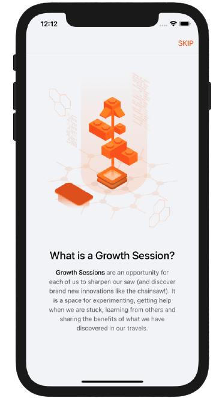
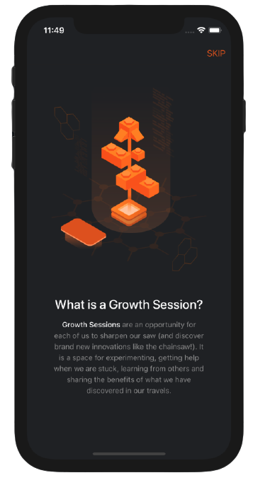
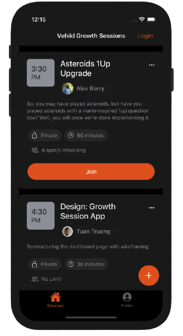
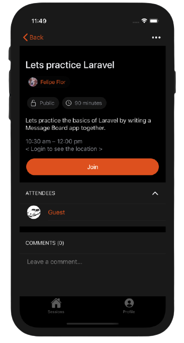
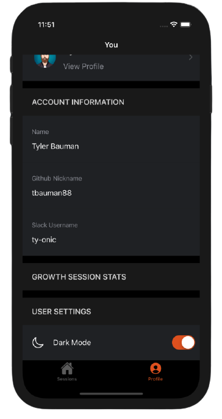

# Vehikl Growth Sessions Mobile App


[](https://app.netlify.com/sites/vehikl-growth/deploys)


## About

This mobile app is a front-end project based off [Vehikl Growth Sessions](https://github.com/vehikl/vehikl-growth-sessions).

### The user must be logged in to;
 - Create a growth session
 - Join private growh sessions

## Development

Running the application

```bash
npm run start
```

## iOS Preview

### Light vs Dark Mode
 

### Sessions, Session Detail and Profile Pages
 

